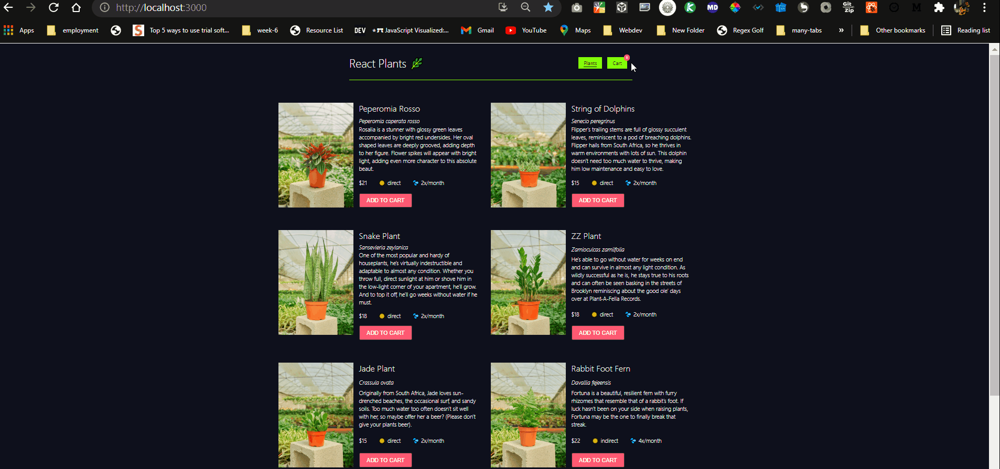
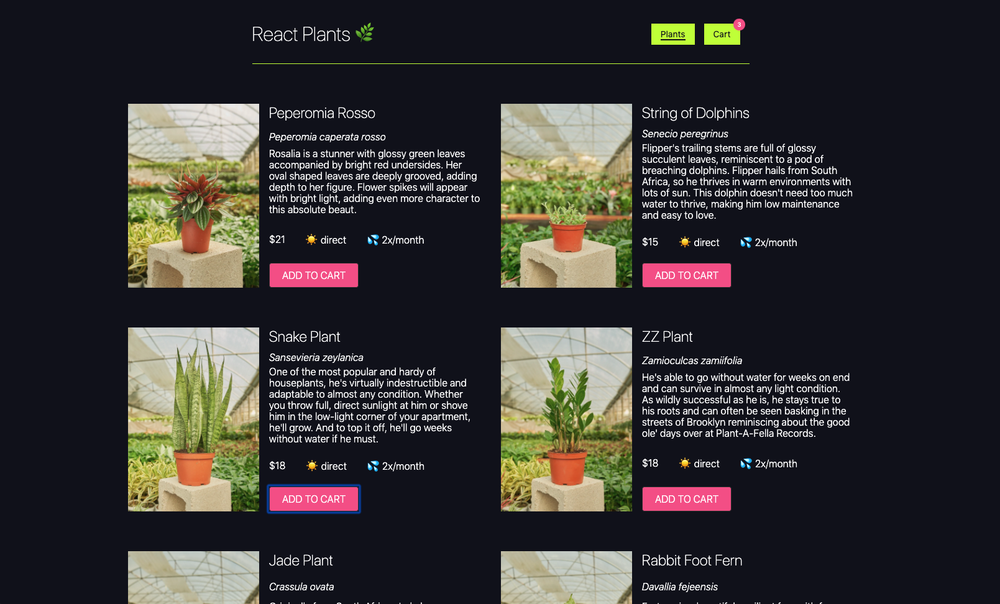
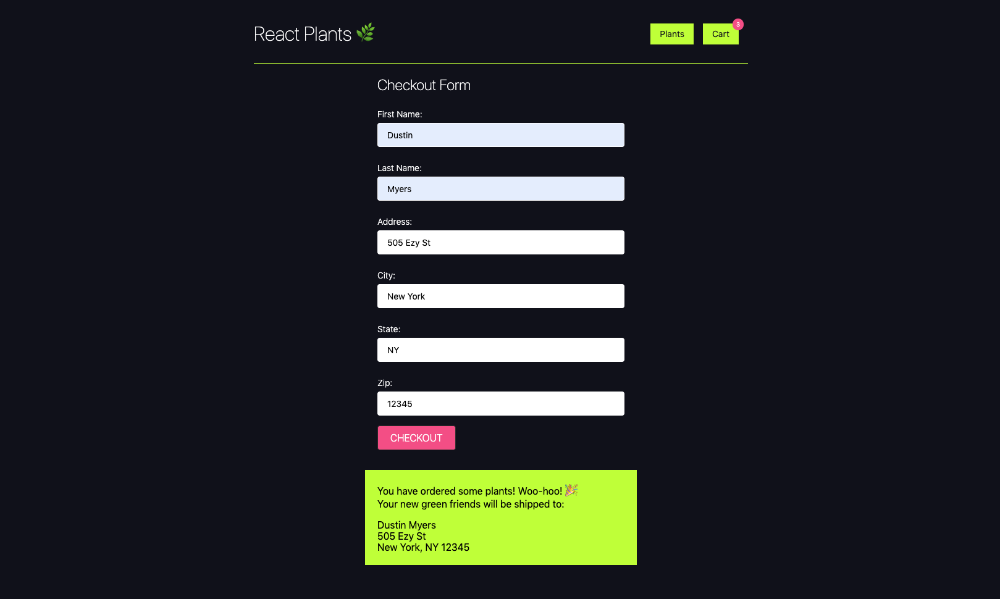
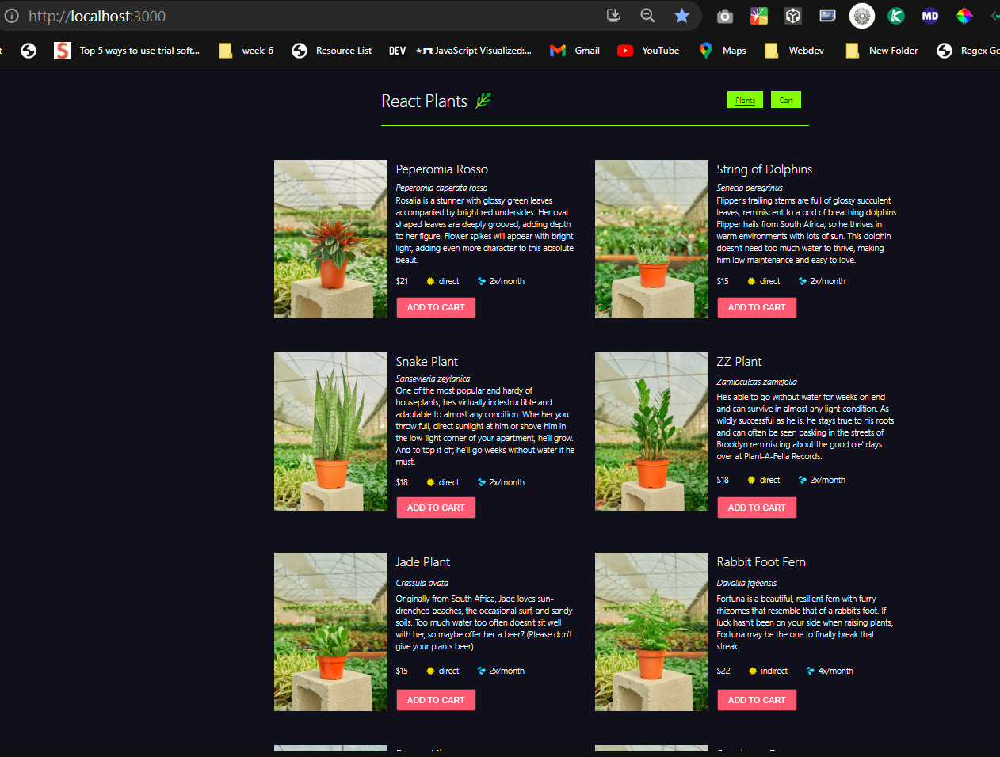

# Sprint Challenge: Advanced React - React Plants 🌿



**Read these instructions carefully. Understand exactly what is expected _before_ starting this Sprint Challenge.**

This challenge allows you to practice the concepts and techniques learned over the past sprint and apply them in a concrete project. This sprint explored some advanced React topics ⚛️.

During this sprint, you studied:

- **class components**
- **the component lifecycle**
- **class component lifecycle methods,**
- **custom hooks**, and
- **React Testing Library .**

## Create an app that will fetch data from an internal server using a `class component`,

## Display that data, using a `custom hook`, and `write tests for your app.`

## Introduction

In this project, you will add class components to your a basic ecommerce site that allow you to request product data from a server and render that data. You will also implement the ablitity to add products to a shopping cart.

In meeting the minimum viable product (MVP) specifications listed below, your project should look like the solution examples below:





You will also need to build the two tests in the `CheckoutForm.test.js` file and make sure they are testing what the test title says they are.

## Instructions

### Task 1: Project Setup

#### Repo Setup

- [ ] Fork and clone this repository.
- [ ] Create a new working branch: git checkout -b `<firstName-lastName>`.
- [ ] Implement the project on your newly created `<firstName-lastName>` branch, committing changes regularly.
- [ ] Push commits: git push origin `<firstName-lastName>`.
- [ ] **RUN** `npm install` to install your dependencies.
- [ ] **RUN** `npm start` to start your application.

* [ ] In another terminal window, **RUN** `npm test` to start your test runner. (It is recommended you do this only when actually building tests - any change in your app will make the tests run, and that could eat up your computer power)

### Task 2: CodeGrade Setup

- [ ] Open the assignment in Canvas and following along with the attached document [here.](https://www.notion.so/lambdaschool/Submitting-an-assignment-via-Code-Grade-A-Step-by-Step-Walkthrough-07bd65f5f8364e709ecb5064735ce374).
- [ ] Follow instructions to set up Codegrade's Webhook and Deploy Key, making sure your deployment is set to your `<firstName-lastName>`.
- [ ] Push your first commit: `git commit --allow-empty -m "first commit" && git push`
- [ ] Check to see that Codegrade has accepted your git submission.

### Task 3: Project Requirements

Your finished project must include all of the following requirements.

#### Plant list

```jsx
import React, { Component } from "react";
import axios from "axios";

export default class PlantList extends Component {
  // add state with a property called "plants" - initialize as an empty array
  constructor() {
    super();
    this.state = {
      plants: [],
    };
  }

  // when the component mounts:
  //   - fetch data from the server endpoint - http://localhost:3333/plants
  //   - set the returned plants array to this.state.plants
  componentDidMount() {
    axios
      .get("http://localhost:3333/plants")
      .then((res) => {
        this.setState({
          plants: res.data,
        });
      })
      .catch((err) => {
        console.log(err);
      });
  }


```



Display a list of the plants from the server. This should be done in the class component `PlantList`. **Unlike other projects, the local server used here can not be accessed through the browser. It is started automatically and without the need for starting a server.js file. Feel free to ignore any messages related to MSW or mock service workers. For this and the rest of your sprint challenges, test the functioning of the server directly through your axios calls.**

- [ ] In the `PlantList` class component, fetch data from the server you now have running - the data can be fetched from `http://localhost:3333/plants.`

```jsx

import React, { Component } from "react";
import axios from "axios";

export default class PlantList extends Component {
  // add state with a property called "plants" - initialize as an empty array
  constructor() {
    super();
    this.state = {
      plants: [],//Set the data to a state property called this.state.plants.
    };
  }

  componentDidMount() {
    axios
      .get("http://localhost:3333/plants")
      .then((res) => {
        this.setState({
          plants: res.data,
        });
      })
      .catch((err) => {
        console.log(err);
      });
  }


```

- [ ] Set the data to a state property called `this.state.plants.`
- [ ] The render function is already built and styled. Once the data is on the state, you will see the list of plants, and you will have the functionality to add a plant to the cart.

#### Shopping Cart

Nothing needs to be done here. You _will_ have to navigate to the cart page in your app so you can go to the checkout form for the next step.

#### Checkout Form

The form is working, but it is currently controlled by local stateful logic. We want to control this form with a custom hook.

- [ ] Build a custom hook called `useForm`, and use it in your CheckoutForm component to control the form's stateful logic.
- [ ] You built a useForm hook in the guided project this week. You will probably need to use that as a guide to complete this step. However, try and build it out first before you peek at the guided project. And _do not_ copy/paste directly from the guided project!\_

#### Testing the Checkout Form

- [ ] Run the test runner and ensure that `src/components/CheckoutForm.test.js` is correctly called.
- [ ] Fill out code necessary to test that that Checkout form renders without errors.
- [ ] Fill out code necessary to test that when all form inputs are filled with valid data, a success message appears.
- [ ] Make sure the tests are passing, and make sure you can cause the tests to fail purposefully, so that you know the tests are truly working.

```sh
|10:47:26|bryan@LAPTOP-9LGJ3JGS:[web-sprint-challenge-advanced-react] web-sprint-challenge-advanced-react_exitstatus:0[╗__________________________________________________________o>

npm run build

> web-sprint-challenge-advanced-react@0.1.0 build
> react-scripts build

Creating an optimized production build...
Browserslist: caniuse-lite is outdated. Please run:
npx browserslist@latest --update-db
Compiled with warnings.

./src/App.js
  Line 1:17:   'useEffect' is defined but never used                                                                                       no-unused-vars
  Line 3:8:    'axios' is defined but never used                                                                                           no-unused-vars
  Line 30:26:  Emojis should be wrapped in <span>, have role="img", and have an accessible description with aria-label or aria-labelledby  jsx-a11y/accessible-emoji

./src/components/PlantList.js
  Line 59:17:  Emojis should be wrapped in <span>, have role="img", and have an accessible description with aria-label or aria-labelledby  jsx-a11y/accessible-emoji
  Line 60:17:  Emojis should be wrapped in <span>, have role="img", and have an accessible description with aria-label or aria-labelledby  jsx-a11y/accessible-emoji

./src/components/CheckoutForm.js
  Line 95:17:   'useState' is defined but never used                                                                                        no-unused-vars
  Line 161:52:  Emojis should be wrapped in <span>, have role="img", and have an accessible description with aria-label or aria-labelledby  jsx-a11y/accessible-emoji

Search for the keywords to learn more about each warning.
To ignore, add // eslint-disable-next-line to the line before.

File sizes after gzip:

  68.09 KB  build/static/js/2.b64a5d33.chunk.js
  3.32 KB   build/static/js/main.a742e80a.chunk.js
  1.1 KB    build/static/css/main.66d197e0.chunk.css
  795 B     build/static/js/runtime-main.6a0e6603.js

The project was built assuming it is hosted at /.
You can control this with the homepage field in your package.json.

The build folder is ready to be deployed.
You may serve it with a static server:

  npm install -g serve
  serve -s build

Find out more about deployment here:
 PASS  src/components/CheckoutForm.test.js (49.058s)
  ✓ form header renders (55ms)
  ✓ form shows success message on submit with form details (193ms)

Test Suites: 1 passed, 1 total
Tests:       2 passed, 2 total
Snapshots:   0 total
Test Suites: 0 of 1 total
Tests:       0 total
Snapshots:   0 total
 PASS  src/components/CheckoutForm.test.js (42.763s)
  ✓ form header renders (119ms)
  ✓ form shows success message on submit with form details (135ms)

Test Suites: 1 passed, 1 total
Tests:       2 passed, 2 total
Snapshots:   0 total
 PASS  src/components/CheckoutForm.test.js (66.651s)
  ✓ form header renders (173ms)
  ✓ form shows success message on submit with form details (145ms)

Test Suites: 1 passed, 1 total
Tests:       2 passed, 2 total
Snapshots:   0 total
Time:        83.499s
Ran all test suites related to changed files.

```

**Notes:**

- Again, unlike other projects, the local server used here can not be accessed through the browser. For this and the rest of your sprint challenges, test the functioning of the server directly through your axios calls.
- You are welcome to create additional files but **do not move or rename existing files** or folders.
- Do not alter your `package.json` file except to install extra libraries.
- In your solution, it is essential that you follow best practices and produce clean and professional results.
- Schedule time to review, refine, and assess your work and perform basic professional polishing including spell-checking and grammar-checking on your work.
- It is better to submit a challenge that meets MVP than one that attempts too much and does not.

### Task 4: Stretch Goals

**IMPORTANT:** Only work on stretch goals after completing your MVP!

When completing these goals, make sure to use a **new branch** to ensure your MVP code is not overwritten. You can branch off `main` by executing `git checkout -b stretch`. When you are fully sure your stretch code is ready for feedback, merge your stretch code with main using `git checkout main` and `git merge stretch.`

After finishing your required elements, you can push your work further. These goals may or may not be things you have learned in this module but they build on the material you just studied. Time allowing, stretch your limits and see if you can deliver on the following optional goals:

- [ ] Add a filter input to the plant list page.
- [ ] Build and implement another custom hook - a dark mode hook would be great for this project, though you'll have to style the light theme 🌙
- [ ] Add a test file for the `ShoppingCart` component and test that it displays plants there (you'll need some mock plant data for the test, and then you can pass that data in as a prop when you call `render` and render the component - see the example below)

```js
const plants = {{}, {}, {}} // with each object being a mock plant
test("displays plants in cart", () => {
  const { getByText } = render(<ShoppingCart cart={plants} />)

  ...

})
```

### Reference Materials

#### API Documentation

- **[GET]** \* to `http://localhost:3333/plants`: returns an array of objects of the following form

```js
{
    name: "Peperomia Rosso",
    id: 143,
    scientificName: "Peperomia caperata rosso",
    difficulty: "easy",
    light: "direct",
    img:
      "https://cdn.shopify.com/s/files/1/2781/9558/products/PEPEROMIA_ROSSO-1_800x.png?v=1587156590",
    sizes: ["small"],
    watering: 2,
    description:
      "Rosalia is a stunner with glossy green leaves accompanied by bright red undersides. Her oval shaped leaves are deeply grooved, adding depth to her figure. Flower spikes will appear with bright light, adding even more character to this absolute beaut.",
    price: 21,
  }
```

## Submission format

- [x] Submit via Codegrade by commiting and pushing any new changes.
- [x] Submit a pull-request to merge <firstName-lastName> branch into main. **Please don't merge your own pull request and make sure you are on your own repo**
- [x] Check codegrade for automated feedback.

## Interview Questions

Be prepared to demonstrate your understanding of this week's concepts by answering questions on the following topics. Add your answers to the questions within `interview_answers.md` file. These will not be counted as a part of your sprint score but will be helpful for preparing you for your endorsement interview, and enhancing overall understanding.

# Interview Answers

### 1. What are the main differences between a stateful and a functional component?

- The difference between a stateful and nonState or functional component is that a stateless (functional component) does not maintain a remembered state value. It simple renders and is done. A stateful component remembers the value of a component and adjusts it to a new value as it's state is changed

### 2. When does a componentWillMount function be called? What about a componentWillUpdate?

- A componentWillMount is called after the constructor function call including super and initial state value.

- componentDidMount is called after the component is mounted on the screen

### 3. Define stateful logic.

- Stateful Logic - is any code that used state to store and update the current state of being with differing values or states.

### 4. What are the three step of creating a successful test? What is done in each phase?

- Arrange - The stage where inputs and targets are set. Arrange sets set up the test cases

- Act - Act on the behavior of the target

- Assert - What are your expected outcomes. this is even defined by expect in the test code syntax.

---

---

## RESULT:
